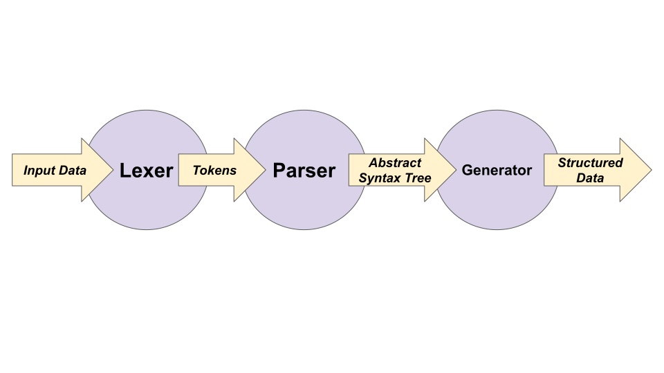

For the first project in my apprenticeship, I decided to learn Elixir by making a command line cookbook app. My inspiration? I had a pile of disorganized .txt files from my travels last year. In their place, I wanted an index of neatly listed titles, where I could toggle back and forth between consistently formatted recipes, retrieving a grocery list at the tap of a key.

**The Challenge**

The first version of my Parser module was a disaster.

First, it needed to know an enormous number of details about a recipe in order to split it up into sections, let alone to generate a grocery list.

```Elixir
def is_before_section_break(remaining_lines) do
  section_break_index = Enum.find_index(remaining_lines, fn x -> x == "" end)
  Enum.slice(remaining_lines, 0..(section_break_index - 1))
end
```
This function was intended to cleave off just the lines between "Ingredients:" and an empty line. But what if the recipe author had divided their ingredients into sections with newlines?

Worse, the logic driving the output was tightly coupled to my CommandLineUI. It relied almost entirely on the line breaks of the .txt file to determine what was an ingredient or directions, and it delivered the parsed output in an array of line-long strings. There was no way it would be able to cleanly plug into to a web-based UI.

*Output Option A: a long string formatted with newlines:*
```Elixir
"Title:\nIce Cubes\n\nIngredients:\n2 cups water (approximately)\n2 tablespoons water (additional if needed)\n\nDirections:\n- Empty any ice cubes that are left in the trays into the bin.\n- Take the trays over to the sink and fill them with water. (Tip: hot water will freeze faster and the cubes will be more clear.)\n- Place the water-filled ice trays back in the freezer.\n- Replace the ice bin if you had to remove it.\n- Shut the door to the freezer.\n- Be sure to leave for around 4-6 hours at least to make sure it is frozen.\n"
```
*Output Option B: an array of formatted strings representing ingredients:*
```Elixir
["- 2 cups water (approximately)\n", "- 2 tablespoons water (additional if needed)\n"]
```

Worst of all, this implementation was brittle to future requirements changes. What if in the future, we wanted to increment the number of servings, or combine grocery lists for two different recipes? This method treated ingredients as solid blocks, instead of a nested piece of information containing a quantity, unit, and ingredient. I could pull out the integers or first character on a line, but then what about fractions? What about ingredients with no units, like "salt and pepper to taste?" What if we just wanted to view the directions of the recipe?

I needed a way to break down each recipe into tiny pieces and stitch it back together, storing the most important information in a way that would be easy to access, aggregate and manipulate.

**My Solution: inspired by the Compiler**

To solve this problem, I decided to make the `Parser` module work like a compiler.



A compiler translates code from one language to another. It works in three phases:
1. The lexer scans each character of your code, uses preset rules to decide what characters should be stored together in a "token," and returns a list of tokens.
2. The parser reads the list of tokens and uses grammar to decide how to translate the tokens into an Abstract Syntax Tree.
3. The generator walks the Abstract Syntax Tree and returns the structured data you need.    


**How It Works**

In my `Parser` module, `parse/1` reads the .txt file and passes that long string to `Lexer.lex/1`. The `Lexer` module uses a "regular expression based lexical analyer generator for Erlang" called `leex`. That's a very long description. Basically, `leex` takes a charlist, uses a list of rules you wrote to clump it into meaningful blobs, and returns a list of tokens, which are tuples in the format `{type, line_number, value}`.

To use `leex`, I simply created a `src` directory in my project and then wrote the rules for each type of token in a `.xrl` file.

Here are my rules:

```
Definitions.

FRACTION = [1-9][0-9]*\/[1-9][0-9]*
INT        = [0-9]+
SECTION_START = SERVESServes|INGREDIENTS|INSTRUCTIONS|WHY|BEFORE
SECTION_END  = (\n\n)
UPCASE_WORD = (<=\s|)[A-Z]+(=\s|)
WORD = (<=\s|)[a-zA-Z]+(=\s|)
CHARACTER = [\"\-\/\@\#\:\;\,\.\'{}\(\)\[\]&\|\*\!]
WHITESPACE = [\s\t\r]
NEW_LINE  = [\n]

Rules.

{INT}         : {token, {int,  TokenLine, list_to_integer(TokenChars)}}.
{FRACTION}         : {token, {fraction,  TokenLine, TokenChars}}.
{SECTION_START}         : {token, {section_start,  TokenLine, TokenChars}}.
{SECTION_END}         : {token, {section_end,  TokenLine, TokenChars}}.
{UPCASE_WORD} : {token, {upcase_word, TokenLine, TokenChars}}.
{WORD} : {token, {word, TokenLine, TokenChars}}.
{CHARACTER} : {token, {char, TokenLine, TokenChars}}.
{NEW_LINE}  : {token, {new_line, TokenLine, TokenChars}}.
{WHITESPACE} : {token, {whitespace, TokenLine, TokenChars}}.

Erlang code.
```

And here is my `Lexer.lex/1` function:

```Elixir
defmodule Lexer do
  def lex(s) when is_binary(s), do: s |> to_charlist |> lex

  def lex(s) do
    {:ok, tokens, _} = :recipe_lexer.string(s)
    tokens
  end
```

Because Elixir is built on Erlang, `leex` comes baked in! When you run your code, `Mix` will compile that `.xrl` file into a `.erl` file. So easy!

The list of tokens generated looks like this:

```Elixir
[
  {:word, 1, 'Mexican'},
  {:whitespace, 1, ' '},
  {:word, 1, 'Corn'},
  {:whitespace, 1, ' '},
  {:word, 1, 'Salad'},
  {:whitespace, 1, ' '},
  {:char, 1, '('},
  {:word, 1, 'Esquites'},
  {:char, 1, ')'},
  {:section_end, 1, '\n\n'},
  {:new_line, 3, '\n'},
  {:section_start, 4, 'INGREDIENTS'},
  {:new_line, 4, '\n'},
  {:int, 5, 3},
  {:whitespace, 5, ' '},
  {:word, 5, 'tablespoons'},
  {:whitespace, 5, ' '},
  {:word, 5, 'lime'},
  {:whitespace, 5, ' '},
  {:word, 5, 'juice'},
  {:char, 5, ','},
  {:whitespace, 5, ' '},
  {:word, 5, 'plus'},
  {:whitespace, 5, ' '},
  {:word, 5, 'extra'},
  {:whitespace, 5, ' '},
  {:word, 5, 'for'},
  {:whitespace, 5, ' '},
  {:word, ...},
  {...},
  ...
]

```

The lexer passes the flat list of tokens back to `Parser`, which uses a chain of Elixir functions to parse it into a nested `%Recipe{}` struct that contains a title, servings, ingredients and directions.

The struct looks like this:

```Elixir
%Recipe{
  directions: [
    %{
      direction: "If desired, substitute plain Greek yogurt for the sour cream. We like serrano chiles here, but you can substitute a jalapeno chile that has been halved lengthwise and sliced into 1/8-inch-thick half-moons. Adjust the amount of chiles to suit your taste. If cotija cheese is unavailable, substitute feta cheese.",
      display_index: "Before you start"
    },
    %{
      direction: "Combine lime juice, sour cream, mayonnaise, serrano(s), and 1/4 teaspoon salt in large bowl. Set aside.",
      display_index: 1
    },
    %{...}
  ],
  ingredients: [
    %Ingredient{
      details: "plus extra for seasoning",
      name: "lime juice",
      quantity: "3",
      unit: 'tablespoons'
    },
    %Ingredient{
      details: nil,
      name: "sour cream",
      quantity: "3",
      unit: 'tablespoons'
    },
    %Ingredient{
      details: "stemmed and cut into 1/8-inch-thick rings",
      name: "serrano chiles",
      quantity: "1-2",
      unit: nil
    },
    %Ingredient{details: nil, name: "Salt", quantity: nil, unit: nil},
    %Ingredient{...}
  ],
  servings: %{max: 8, min: 6},
  title: "Mexican Corn Salad (Esquites)"
}
```

Phew. Much nicer than an array of strings.

**Tradeoffs and Other Options I Considered**

The Erlang lexer-builder, `leex`, has a companion parser-builder, `yecc`. `leex` and `yecc` are named after [Lex and Yacc](http://dinosaur.compilertools.net/), a popular lexer and compiler. `yecc` uses rules you write in Erlang to build an abstract syntax tree out of your tokens.

I decided not to use `yecc` to build an abstract syntax tree, partially because I don't know Erlang yet and found the syntax more challenging than `leex`. But, more importantly, the flat list of tokens generated by `Lexer.lex/1` actually contains all the information I need to organize the recipe. For other types of data, like HTML and Markdown, a token's level of nesting impacts the way that token should be processed. For a recipe, not so. In those cases, an abstract syntax tree would be the way to go.

My approach has limitations. There are infinite minute text variations that throw a wrench into the chain of parsing functions. For example, the grocery list generator is bewildered by "boneless, skinless chicken thighs" because `Parser.parse_ingredients/1` assumes everything that comes after a comma inside an ingredient is "details," not "name." An abstract syntax tree and generator would make it easier to change the rules governing how that comma gets parsed.


**Final Outcome**

Modeling the business logic after a compiler by using a lexer and a parser has left me with a much more extensible app. With a little templating, the nested struct that `Parser` generates could easily be plugged into a web-based UI.

Even better, it now parses ingredients into their own data structures, and can even handle recipes with sub-recipes that contain their own lists of ingredients!

```Elixir

%Recipe{
  directions: [...],
  ingredients: [
    %Recipe{
      directions: nil,
      ingredients: [
        %Ingredient{
          details: nil,
          name: "plain whole-milk yogurt",
          quantity: "1",
          unit: 'cup'
        }, [...]
      ],
      servings: nil,
      title: "YOGURT SAUCE"
    },
    %Recipe{
      directions: nil,
      ingredients: [
        %Ingredient{
          details: "(1 1/4 cups) green or brown lentils, picked over and rinsed",
          name: "green or brown lentils",
          quantity: "8 1/2",
          unit: 'ounces'
        }, [...]
      ],
      servings: nil,
      title: "RICE AND LENTILS"
    }
  ],
  servings: %{max: 6, min: 4},
  title: "Rice and Lentils with Crispy Onions (Mujaddara)"
}

```

To see more of the code, feel free to check out the repo on Github! Thanks to Thomas Countz and Cameron Price, whose blog posts on their compiler-inspired adventures greatly contributed to the success of this project implementation.
